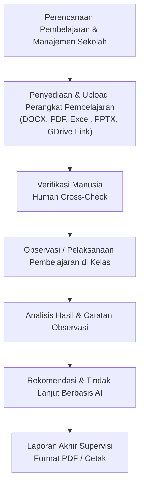
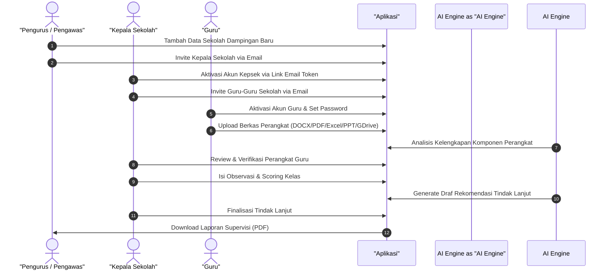

# 01 — Product Overview

## 1. Gambaran Umum Produk

Aplikasi **Sistem Supervisi Akademik Guru Berbasis AI** adalah platform workflow supervisi terpadu yang dirancang untuk membantu Pengawas Sekolah, Kepala Sekolah, dan Guru dalam melaksanakan seluruh rangkaian supervisi akademik.

Tujuan utama aplikasi adalah mempermudah dan menstandarkan siklus supervisi guru dari tahap awal hingga akhir:

---

## 2. Peran AI dalam Produk

Aplikasi memanfaatkan **Artificial Intelligence (AI)** sebagai asisten untuk:
1. Menganalisis kelengkapan dan kualitas perangkat pembelajaran yang diunggah dalam berbagai format berkas (DOCX, PDF, XLSX, PPTX, scan/gambar) maupun tautan Google Drive.
2. Membaca dan mensintesis hasil observasi kelas bersama catatan dari observer.
3. Memberikan rekomendasi program tindak lanjut bagi guru.

> **Prinsip Utama AI:** AI **BUKAN** pengambil keputusan akhir. Seluruh hasil rekomendasi dan analisis AI harus dapat dilihat, dikroscek, dikoreksi, disetujui, atau ditolak secara manual oleh Pengawas atau Kepala Sekolah.

---

## 3. Latar Belakang & Konteks Client

Berdasarkan komunikasi awal dengan client:
- Aplikasi dibuat untuk menilai kinerja guru dalam rangka supervisi akademik.
- Pengguna aplikasi terdiri dari 3 role: **Pengawas (Pengurus)**, **Kepala Sekolah**, dan **Guru**.
- **Alur Pendaftaran User:** Pengurus wajib mendaftarkan/membuat data Sekolah terlebih dahulu sebagai wadah. Setelah itu Pengurus mengundang Kepala Sekolah via Email Invitation, dan Kepala Sekolah (atau Pengurus) mengundang Guru-Guru via Email Invitation.
- **Fleksibilitas Upload Berkas:** Guru dapat mengunggah berkas perangkat pembelajaran dalam **berbagai format (DOCX, PDF, XLSX/Excel, PPTX/PPT, Gambar, dll.)** maupun menautkan Google Drive Public Link.
- Pengawas memegang tanggung jawab atas **beberapa sekolah**.
- Kepala Sekolah berfokus pada **sekolah yang dipimpinnya sendiri**.

---

## 4. Skenario End-to-End Simulasi Supervisi

Berikut adalah contoh skenario alur kerja dari awal sampai akhir:

---

## 5. Ringkasan Fitur Utama Produk

- **User Onboarding & School Management:** Manajemen hirarki pengguna berbasis invitasi email dan pembuatan master data sekolah terlebih dahulu.
- **Multi-Format Document Upload & GDrive Link:** Fleksibilitas penyediaan berkas perangkat pembelajaran dalam format DOCX, PDF, XLSX, PPTX, image, maupun tautan Google Drive.
- **Supervision / Observation Management:** Pengelolaan instrumen fleksibel, pengisian observasi kelas, dan kalkulasi skor otomatis.
- **AI-Assisted Follow-up & Reporting:** Rekomendasi tindak lanjut berbantuan AI serta pembuatan laporan supervisi terpadu.

