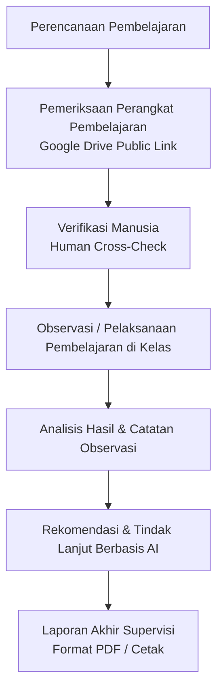
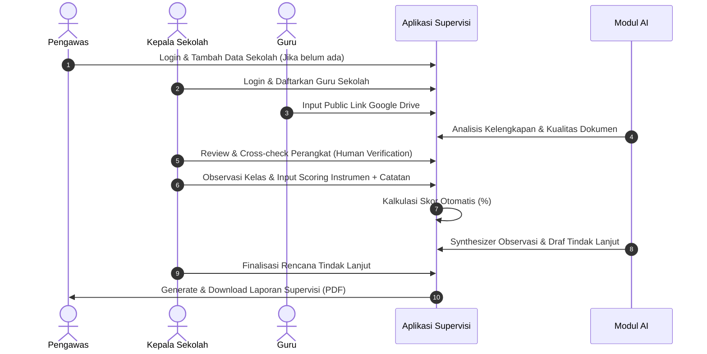

# 01 — Product Overview

## 1. Gambaran Umum Produk

Aplikasi **Sistem Supervisi Akademik Guru Berbasis AI** adalah platform workflow supervisi terpadu yang dirancang untuk membantu Pengawas Sekolah, Kepala Sekolah, dan Guru dalam melaksanakan seluruh rangkaian supervisi akademik.

Tujuan utama aplikasi adalah mempermudah dan menstandarkan siklus supervisi guru dari tahap awal hingga akhir:

---

## 2. Peran AI dalam Produk

Aplikasi memanfaatkan **Artificial Intelligence (AI)** sebagai asisten untuk:
1. Menganalisis kelengkapan dan kualitas perangkat pembelajaran yang terhubung via Google Drive.
2. Membaca dan mensintesis hasil observasi kelas bersama catatan dari observer.
3. Memberikan rekomendasi program tindak lanjut bagi guru.

> **Prinsip Utama AI:** AI **BUKAN** pengambil keputusan akhir. Seluruh hasil rekomendasi dan analisis AI harus dapat dilihat, dikroscek, dikoreksi, disetujui, atau ditolak secara manual oleh Pengawas atau Kepala Sekolah.

---

## 3. Latar Belakang & Konteks Client

Berdasarkan komunikasi awal dengan client:
- Aplikasi dibuat untuk menilai kinerja guru dalam rangka supervisi akademik.
- Pengguna aplikasi terdiri dari 3 role: **Pengawas**, **Kepala Sekolah**, dan **Guru**.
- Pengawas memegang tanggung jawab atas **beberapa sekolah**.
- Kepala Sekolah berfokus pada **sekolah yang dipimpinnya sendiri**.
- Guru menyediakan dokumen perangkat pembelajaran yang tersimpan di **Google Drive** (via Public Link "Anyone with the link can view").

---

## 4. Skenario End-to-End Simulasi Supervisi

Berikut adalah contoh skenario alur kerja dari awal sampai akhir:

---

## 5. Ringkasan Fitur Utama Produk

- **Document / Planning Management:** Pengelolaan dan pemeriksaan perangkat pembelajaran via Google Drive Public Link.
- **Supervision / Observation Management:** Pengelolaan instrumen fleksibel, pengisian observasi kelas, dan kalkulasi skor otomatis.
- **AI-Assisted Follow-up & Reporting:** Rekomendasi tindak lanjut berbantuan AI serta pembuatan laporan supervisi terpadu.
