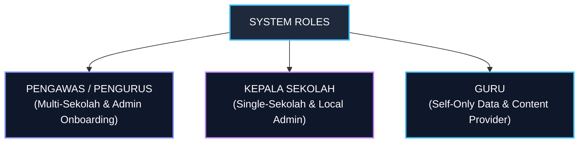

# 02 — Roles & Permissions

## 1. Definisi Role Pengguna

Aplikasi memiliki 3 role utama yang ditentukan berdasarkan kewenangan, hirarki pendaftaran, dan batasan cakupan (scope) data:

---

## 2. Rincian Role & Scope Akses

### 2.1 Pengawas Sekolah / Pengurus
- **Cakupan (Scope):** Memiliki tanggung jawab atas **beberapa sekolah** (multi-school access) dan administrasi onboarding tingkat wilayah/pengawas.
- **Hirarki & Kewenangan Onboarding:**
  - **Prasyarat Utama:** Pengawas wajib membuat data master Sekolah (`schools`) terlebih dahulu sebelum mengundang pengguna lain.
  - Mengirimkan **Invitasi Email** untuk mendaftarkan Kepala Sekolah pada sekolah dampingan.
  - Mengirimkan **Invitasi Email** untuk mendaftarkan Guru jika diperlukan.
- **Kewenangan Utama Supervisi:**
  - Melihat dashboard agregat lintas sekolah yang diawasi.
  - Memeriksa perangkat pembelajaran guru dari semua sekolah dampingan (format DOCX, PDF, Excel, PPT, Maupun GDrive Link).
  - Melakukan cross-check dan verifikasi terhadap hasil analisis AI.
  - Mengelola dan membuat instrumen observasi pembelajaran.
  - Melaksanakan observasi kelas, mengisi penilaian, dan memberikan catatan.
  - Mengulas, menyunting, dan menyetujui rekomendasi tindak lanjut AI.
  - Melihat dan mengunduh laporan supervisi individual maupun rekapitulasi sekolah.

### 2.2 Kepala Sekolah
- **Cakupan (Scope):** Berfokus penuh pada **satu sekolahnya sendiri** (single-school access).
- **Hirarki & Kewenangan Onboarding:**
  - Diundang ke sistem oleh Pengurus via Email Invitation.
  - Berwenang mengirimkan **Invitasi Email** untuk mendaftarkan Guru-Guru di sekolahnya.
- **Kewenangan Utama Supervisi:**
  - Melihat dashboard khusus untuk sekolahnya sendiri.
  - Memantau daftar guru dan progres supervisi di sekolahnya.
  - Memeriksa kelengkapan perangkat pembelajaran guru di sekolahnya (berbagai format berkas).
  - Melakukan cross-check manual terhadap hasil rekomendasi AI.
  - Menyesuaikan/membuat instrumen observasi.
  - Melakukan observasi kelas, memberi nilai, dan memberikan catatan per indikator.
  - Mengelola dan menetapkan rencana tindak lanjut supervisi guru.
  - Mengunduh laporan supervisi untuk guru di sekolahnya.

### 2.3 Guru
- **Cakupan (Scope):** Hanya memiliki akses terhadap **data dan dokumen miliknya sendiri** (self-only access).
- **Hirarki & Onboarding:**
  - Diundang oleh Kepala Sekolah atau Pengurus via Email Invitation.
  - Mengaktifkan akun dengan menetapkan kata sandi pribadi via token email.
- **Kewenangan Utama:**
  - **Upload Berkas Perangkat Pembelajaran:** Mengunggah langsung berkas persiapan mengajar dalam **format apapun (DOCX, PDF, XLSX/Excel, PPTX/PPT, Gambar/Scan, dll.)**.
  - **Input Public Link Google Drive:** Menautkan folder/berkas Google Drive publik sebagai opsi alternatif.
  - Melihat hasil verifikasi perangkat pembelajaran dari Pengawas/Kepsek.
  - Melihat jadwal dan hasil observasi pembelajaran.
  - Melihat rekomendasi dan program tindak lanjut yang telah disetujui.

---

## 3. Matriks Hak Akses Fitur (Permission Matrix)

| Fitur / Modul | Pengawas / Pengurus | Kepala Sekolah | Guru |
| :--- | :---: | :---: | :---: |
| **Buat Master Data Sekolah (Prasyarat)** | ✅ | ❌ | ❌ |
| **Invite Kepala Sekolah via Email** | ✅ | ❌ | ❌ |
| **Invite Guru via Email** | ✅ | ✅ (Sekolah Sendiri) | ❌ |
| **Dashboard Rekap Multi-Sekolah** | ✅ | ❌ | ❌ |
| **Dashboard Rekap Sekolah Sendiri** | ✅ | ✅ | ❌ |
| **Upload Berkas Perangkat (DOCX/PDF/Excel/PPT/dll)** | ❌ | ❌ | ✅ (Milik sendiri) |
| **Input Public Link Google Drive** | ❌ | ❌ | ✅ (Milik sendiri) |
| **Lihat Perangkat Pembelajaran** | ✅ (Sekolah Dampingan) | ✅ (Sekolah Sendiri) | ✅ (Milik Sendiri) |
| **Verifikasi AI Perangkat** | ✅ | ✅ | ❌ |
| **Kelola Instrumen Observasi** | ✅ | ✅ | ❌ |
| **Isi Observasi & Skor Kelas** | ✅ | ✅ | ❌ |
| **Isi Catatan per Indikator** | ✅ | ✅ | ❌ |
| **Verifikasi Rekomendasi AI** | ✅ | ✅ | ❌ |
| **Kelola Item Tindak Lanjut** | ✅ | ✅ | 👁️ (Read Only) |
| **Cetak / Download Laporan** | ✅ | ✅ | 👁️ (Lihat Laporan Sendiri) |

---

## 4. Prinsip Keamanan & Otorisasi Backend

1. **Enforcement di Server:** Pembatasan hak akses dan scope data **wajib dieksekusi di layer backend/API**, bukan sekadar disembunyikan di tampilan frontend UI.
2. **Multi-Tenancy Isolation:**
   - Query data untuk Pengawas wajib difilter berdasarkan `supervisor_school_assignments`.
   - Query data untuk Kepala Sekolah wajib difilter berdasarkan `user.school_id`.
   - Query data untuk Guru wajib difilter berdasarkan `user.id` / `teacher_id`.
3. **Validasi Token Invitasi:** Pendaftaran user baru wajib melalui pemicuan token unik terenkripsi dengan waktu kadaluarsa (72 jam) dan pencegahan akses login sebelum akun `ACTIVE`.
4. **Audit Access:** Setiap percobaan akses ilegal ke sekolah lain harus dicatat pada log audit sistem.

