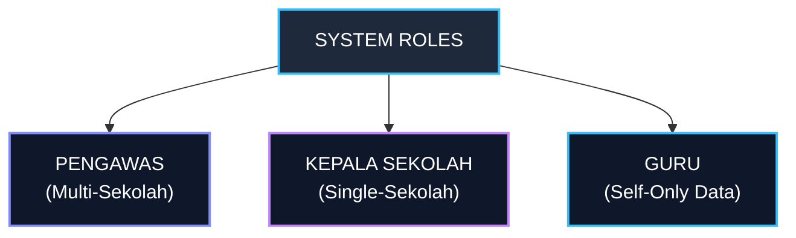
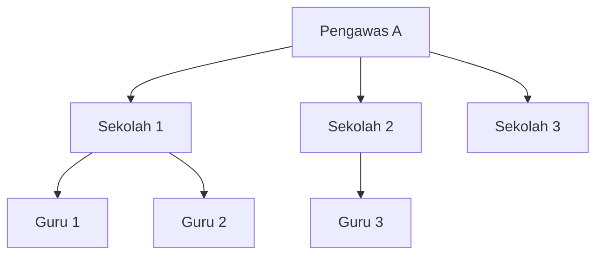
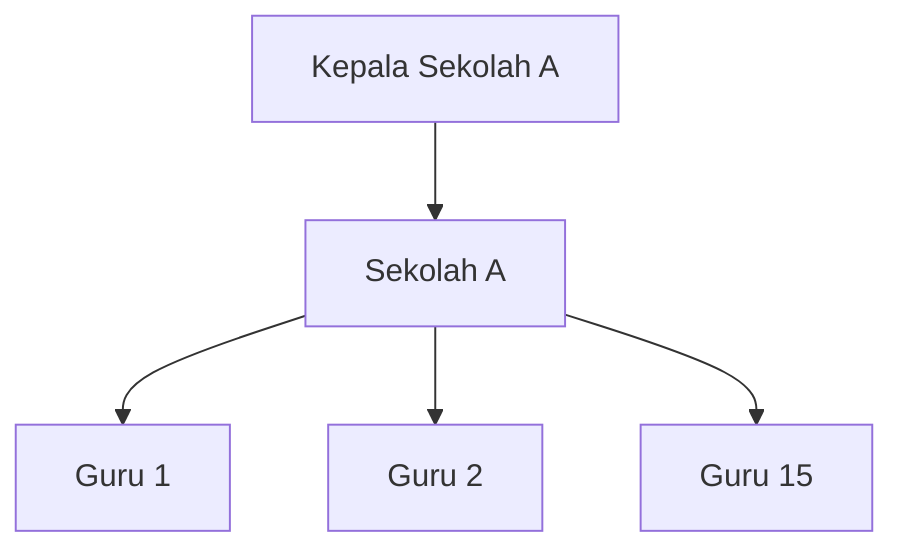

# 02 — Roles & Permissions

## 1. Definisi Role Pengguna

Aplikasi memiliki 3 role utama yang ditentukan berdasarkan kewenangan dan batasan cakupan (scope) data:

---

## 2. Rincian Role & Scope Akses

### 2.1 Pengawas Sekolah
- **Cakupan (Scope):** Memiliki tanggung jawab atas **beberapa sekolah** (multi-school access).
- **Hirarki:**

- **Kewenangan Utama:**
  - Melihat dashboard agregat lintas sekolah yang diawasi.
  - Menambahkan data sekolah secara manual ke dalam cakupan pengawasannya.
  - Memeriksa perangkat pembelajaran guru dari semua sekolah dampingan.
  - Melakukan cross-check dan verifikasi terhadap hasil analisis AI.
  - Mengelola dan membuat instrumen observasi pembelajaran.
  - Melaksanakan observasi kelas, mengisi penilaian, dan memberikan catatan.
  - Mengulas, menyunting, dan menyetujui rekomendasi tindak lanjut AI.
  - Melihat dan mengunduh laporan supervisi individual maupun rekapitulasi sekolah.

### 2.2 Kepala Sekolah
- **Cakupan (Scope):** Berfokus penuh pada **satu sekolahnya sendiri** (single-school access).
- **Hirarki:**

- **Kewenangan Utama:**
  - Melihat dashboard khusus untuk sekolahnya sendiri (tidak melihat data sekolah lain).
  - Memantau daftar guru dan progres supervisi di sekolahnya.
  - Memeriksa kelengkapan perangkat pembelajaran guru di sekolahnya.
  - Melakukan cross-check manual terhadap hasil rekomendasi AI.
  - Menyesuaikan/membuat instrumen observasi (jika diizinkan aturan sekolah).
  - Melakukan observasi kelas, memberi nilai, dan memberikan catatan per indikator.
  - Mengelola dan menetapkan rencana tindak lanjut supervisi guru.
  - Mengunduh laporan supervisi untuk guru di sekolahnya.

### 2.3 Guru
- **Cakupan (Scope):** Hanya memiliki akses terhadap **data dan dokumen miliknya sendiri** (self-only access).
- **Kewenangan Utama:**
  - Menautkan Public Link Google Drive ke aplikasi.
  - Memilih/menempelkan folder/dokumen perangkat pembelajaran untuk disupervisi.
  - Melihat hasil verifikasi perangkat pembelajaran dari Pengawas/Kepsek.
  - Melihat jadwal dan hasil observasi pembelajaran.
  - Melihat rekomendasi dan program tindak lanjut yang telah disetujui.

---

## 3. Matriks Hak Akses Fitur (Permission Matrix)

| Fitur / Modul | Pengawas | Kepala Sekolah | Guru |
| :--- | :---: | :---: | :---: |
| **Dashboard Rekap Multi-Sekolah** | ✅ | ❌ | ❌ |
| **Dashboard Rekap Sekolah Sendiri** | ✅ | ✅ | ❌ |
| **Tambah Data Sekolah Manual** | ✅ | ❌ | ❌ |
| **Input Public Link Google Drive** | ❌ | ❌ | ✅ (Milik sendiri) |
| **Lihat Perangkat Pembelajaran** | ✅ (Sekolah Dampingan) | ✅ (Sekolah Sendiri) | ✅ (Milik Sendiri) |
| **Verifikasi AI Perangkat** | ✅ | ✅ | ❌ |
| **Kelola Instrumen Observasi** | ✅ | ✅ | ❌ |
| **Isi Observasi & Skor Kelas** | ✅ | ✅ | ❌ |
| **Isi Catatan per Indikator** | ✅ | ✅ | ❌ |
| **Verifikasi Rekomendasi AI** | ✅ | ✅ | ❌ |
| **Kelola Item Tindak Lanjut** | ✅ | ✅ | 👁️ (Read Only) |
| **Cetak / Download Laporan** | ✅ | ✅ | 👁️ (Lihat Laporan Sendiri) |

---

## 4. Prinsip Keamanan & Otorisasi Backend

1. **Enforcement di Server:** Pembatasan hak akses dan scope data **wajib dieksekusi di layer backend/API**, bukan sekadar disembunyikan di tampilan frontend UI.
2. **Multi-Tenancy Isolation:**
   - Query data untuk Pengawas wajib difilter berdasarkan `supervisor_school_assignments`.
   - Query data untuk Kepala Sekolah wajib difilter berdasarkan `user.school_id`.
   - Query data untuk Guru wajib difilter berdasarkan `user.id` / `teacher_id`.
3. **Audit Access:** Setiap percobaan akses ilegal ke sekolah lain harus dicatat pada log audit sistem.
