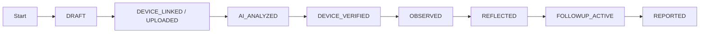

# 03 — Business Workflows

## 1. Alur Bisnis Utuh Supervisi Guru

Siklus supervisi guru terdiri dari 7 tahapan utama yang terintegrasi secara runtut:

```mermaid
flowchart LR
    T1["1. Onboarding & Sekolah"] --> T2["2. Upload Perangkat"]
    T2 --> T3["3. Analisis & Verifikasi"]
    T3 --> T4["4. Observasi Kelas"]
    T4 --> T5["5. Refleksi Guru"]
    T5 --> T6["6. Tindak Lanjut"]
    T6 --> T7["7. Laporan Akhir"]

    style T1 fill:#1e293b,stroke:#38bdf8,stroke-width:1.5px,color:#fff
    style T2 fill:#1e293b,stroke:#818cf8,stroke-width:1.5px,color:#fff
    style T3 fill:#1e293b,stroke:#c084fc,stroke-width:1.5px,color:#fff
    style T4 fill:#1e293b,stroke:#34d399,stroke-width:1.5px,color:#fff
    style T5 fill:#1e293b,stroke:#a7f3d0,stroke-width:1.5px,color:#065f46
    style T6 fill:#1e293b,stroke:#f43f5e,stroke-width:1.5px,color:#fff
    style T7 fill:#1e293b,stroke:#fbbf24,stroke-width:1.5px,color:#fff
```

---

## 2. Rincian Langkah per Tahapan Workflow

### Tahap 1: Inisialisasi Sekolah & Registrasi User via Invitasi Email
1. **Pengurus (Pengawas / Admin System)** masuk ke aplikasi dan terlebih dahulu **membuat data Sekolah (`schools`)** sebagai wadah tenant.
2. **Pengurus** mendaftarkan Kepala Sekolah dengan memasukkan email & data sekolah -> **Sistem mengirimkan Email Invitasi** dengan token terenkripsi.
3. **Kepala Sekolah** membuka email, mengklik link aktivasi, menetapkan kata sandi baru, dan mengaktifkan akun.
4. **Kepala Sekolah** (atau Pengurus) mendaftarkan Guru-Guru dengan memasukkan nama, email, NIP, mapel -> **Sistem mengirimkan Email Invitasi** ke Guru.
5. **Guru** mengaktifkan akun via email, membuat password, dan melengkapi data profil.
6. **Pengawas / Kepala Sekolah** mengonfigurasi periode supervisi (misal: Semester Ganjil 2026/2027).

### Tahap 2: Penyediaan & Unggah Perangkat Pembelajaran (Multi-Format & GDrive)
1. **Guru** menyiapkan berkas perangkat pembelajaran (RPP, Modul Ajar, Bahan Ajar, LKPD, Asesmen, Prota/Promes).
2. **Opsi 1 — Upload Berkas Langsung:** Guru mengunggah berkas dalam **format apapun (PDF, DOCX, XLSX/Excel, PPTX/PPT, PNG/JPG)** langsung dari perangkat komputer/HP.
3. **Opsi 2 — Public Link Google Drive:** Guru menempelkan tautan publik berkas/folder Google Drive (*Anyone with the link can view*).
4. **Aplikasi** menyimpan berkas/tautan dan memproses ekstraksi teks/metadata untuk kebutuhan analisis AI dan verifikasi Pengawas/Kepsek.

### Tahap 3: Analisis AI & Verifikasi Perangkat Pembelajaran
1. **AI System** memproses isi dokumen (dari unggahan langsung maupun Google Drive) untuk mendeteksi jenis perangkat, tingkat kelengkapan komponen, dan indikator kualitas.
2. **AI System** menampilkan saran pemetaan dan catatan analisis kelengkapan ke dashboard Pengawas dan Kepala Sekolah.
3. **Pengawas / Kepala Sekolah (Human Reviewer)** meninjau setiap item hasil analisis AI:
   - Menyetujui (`Accept`),
   - Mengoreksi jenis/status (`Correct`), atau
   - Menolak (`Reject`).
4. **Status Perangkat** berubah menjadi `Verified` setelah ditinjau manusia.

### Tahap 4: Pelaksanaan Observasi Kelas & Scoring Fleksibel
1. **Observer (Pengawas / Kepsek)** memilih instrumen observasi yang sesuai (dengan indikator dan skala penilaian yang sudah dikonfigurasi).
2. **Observer** melakukan pengamatan langsung di kelas.
3. **Observer** mengisi skor (skala 1–3 atau 1–4) dan catatan kualitatif untuk setiap indikator pada formulir observasi.
4. **Sistem** menghitung total nilai perolehan, nilai maksimal, dan persentase akhir observasi secara aktual.

### Tahap 5: Refleksi Diri Guru Pasca-Observasi Kelas
1. **Guru** mengakses formulir refleksi diri supervisi pasca-observasi kelas di aplikasi.
2. **Guru** mengisikan poin-poin reflektif meliputi:
   - Hal-hal positif / kekuatan yang sudah berjalan baik saat mengajar di kelas.
   - Kendala atau kesulitan yang dihadapi guru selama proses pembelajaran.
   - Aspek keterampilan mengajar yang ingin ditingkatkan/diperbaiki.
   - Bentuk bantuan atau program pelatihan yang diharapkan guru.
3. **Sistem** menyimpan data refleksi guru sebagai salah satu bahan pertimbangan utama dalam analisis tindak lanjut.

### Tahap 6: Analisis AI Rekomendasi & Penetapan Tindak Lanjut
1. **AI System** membaca input tri-partit gabungan dari:
   - Hasil verifikasi perangkat pembelajaran (Tahap 3).
   - Hasil skor dan catatan per indikator observasi (Tahap 4).
   - Input refleksi diri guru pasca-observasi kelas (Tahap 5).
2. **AI System** menyusun draf ringkasan kelebihan, area perbaikan, serta rekomendasi program tindak lanjut yang selaras dengan temuan observer dan kebutuhan reflektif guru.
3. **Observer (Pengawas / Kepsek)** bersama Guru meninjau rekomendasi AI, mengedit deskripsi tindakan, menentukan penanggung jawab, target waktu (deadline), dan menyetujui program tindak lanjut.
4. **Item Tindak Lanjut** disimpan dengan status `Disetujui` / `Dalam Proses`.

### Tahap 7: Penyusunan & Unduh Laporan Akhir Supervisi
1. **Sistem** merangkum seluruh data dari Tahap 1 sampai Tahap 6 ke dalam satu berkas Laporan Supervisi Guru.
2. **Pengawas / Kepala Sekolah** memeriksa draf laporan.
3. **Laporan** difinalisasi dan dapat diunduh dalam format resmi (misal PDF) untuk dokumentasi sekolah dan dinas.

---

## 3. Diagram Status & Transisi Dokumen Supervisi

