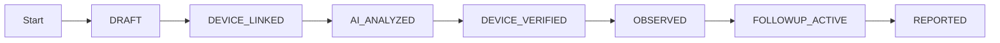

# 03 — Business Workflows

## 1. Alur Bisnis Utuh Supervisi Guru

Siklus supervisi guru terdiri dari 6 tahapan utama yang terintegrasi secara runtut:

```mermaid
flowchart LR
    T1["1. Perencanaan"] --> T2["2. Penautan Perangkat"]
    T2 --> T3["3. Analisis & Verifikasi"]
    T3 --> T4["4. Observasi Kelas"]
    T4 --> T5["5. Tindak Lanjut"]
    T5 --> T6["6. Laporan Akhir"]

    style T1 fill:#1e293b,stroke:#38bdf8,stroke-width:1.5px,color:#fff
    style T2 fill:#1e293b,stroke:#818cf8,stroke-width:1.5px,color:#fff
    style T3 fill:#1e293b,stroke:#c084fc,stroke-width:1.5px,color:#fff
    style T4 fill:#1e293b,stroke:#34d399,stroke-width:1.5px,color:#fff
    style T5 fill:#1e293b,stroke:#f43f5e,stroke-width:1.5px,color:#fff
    style T6 fill:#1e293b,stroke:#fbbf24,stroke-width:1.5px,color:#fff
```

---

## 2. Rincian Langkah per Tahapan Workflow

### Tahap 1: Perencanaan Supervisi & Pengaturan Sekolah
1. **Pengawas** masuk ke aplikasi, mengonfigurasi periode supervisi (misal Semester Ganjil 2026/2027).
2. **Pengawas** menambahkan data sekolah dampingan baru secara manual jika belum ada dalam sistem.
3. **Kepala Sekolah** atau sistem mendaftarkan data guru yang akan disupervisi pada periode berjalan.

### Tahap 2: Penyediaan & Penautan Perangkat (Google Drive Public Link)
1. **Guru** menyusun berkas di Google Drive dan membagikannya dengan akses *Anyone with the link can view*.
2. **Guru** memasukkan/menempelkan (paste) tautan publik folder atau berkas perangkat ke form aplikasi supervisi.
3. **Aplikasi** menyimpan tautan tersebut dan memuat metadata berkas untuk kebutuhan analisis AI dan verifikasi Pengawas/Kepsek.

### Tahap 3: Analisis AI & Verifikasi Perangkat Pembelajaran
1. **AI System** memproses isi dokumen dari Google Drive untuk mendeteksi jenis perangkat, tingkat kelengkapan komponen, dan indikator kualitas.
2. **AI System** menampilkan saran pemetaan dan catatan analisis kelengkapan ke dashboard Pengawas dan Kepala Sekolah.
3. **Pengawas / Kepala Sekolah (Human Reviewer)** meninjau setiap item hasil analisis AI:
   - Menyetujui (`Accept`),
   - Mengoreksi jenis/status (`Correct`), atau
   - Menolak (`Reject`).
4. **Status Perangkat** berubah menjadi `Verified` setelah ditinjau manusia.

### Tahap 4: Pelaksanaan Observasi Kelas & Scoring Fleksibel
1. **Observer (Pengawas / Kepsek)** memilih instrumen observasi yang sesuai (dengan indikator dan skala penilaian yang sudah dikonfigurasi).
2. **Observer** melakukan pengamatan langsung di kelas.
3. **Observer** mengisi skor (skala 1–3 atau 1–4) dan catatan kualitatif untuk setiap indikator pada formulir observasi.
4. **Sistem** menghitung total nilai perolehan, nilai maksimal, dan persentase akhir observasi secara aktual.

### Tahap 5: Analisis AI Rekomendasi & Penetapan Tindak Lanjut
1. **AI System** membaca input gabungan dari:
   - Hasil verifikasi perangkat pembelajaran (Tahap 3).
   - Hasil skor dan catatan per indikator observasi (Tahap 4).
2. **AI System** menyusun draf ringkasan kelebihan, area perbaikan, dan rekomendasi program tindak lanjut.
3. **Observer (Pengawas / Kepsek)** meninjau rekomendasi AI, mengedit deskripsi tindakan, menentukan penanggung jawab, target waktu (deadline), dan menyetujui program tindak lanjut.
4. **Item Tindak Lanjut** disimpan dengan status `Disetujui` / `Dalam Proses`.

### Tahap 6: Penyusunan & Unduh Laporan Akhir Supervisi
1. **Sistem** merangkum seluruh data dari Tahap 1 sampai Tahap 5 ke dalam satu berkas Laporan Supervisi Guru.
2. **Pengawas / Kepala Sekolah** memeriksa draf laporan.
3. **Laporan** difinalisasi dan dapat diunduh dalam format resmi (misal PDF) untuk dokumentasi sekolah dan dinas.

---

## 3. Diagram Status & Transisi Dokumen Supervisi

