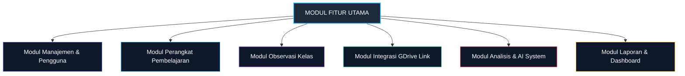

# 04 — Feature Modules

## 1. Daftar Modul Fitur Aplikasi

Sistem Supervisi Guru terdiri dari modul-modul fitur utama sebagai berikut:

---

## 2. Deskripsi Rinci Modul

### 2.1 Modul Manajemen Sekolah & Pengguna
- **Fungsi:** Mengelola data master sekolah, pengawas, kepala sekolah, dan guru.
- **Fitur Utama:**
  - *Input Sekolah Manual oleh Pengawas:* Pengawas dapat menambah data sekolah dampingan secara manual.
  - *Penugasan Pengawas ke Sekolah:* Menghubungkan 1 pengawas dengan N sekolah.
  - *Manajemen Data Guru:* Mengelola profil guru, mata pelajaran, dan kelas yang diampu.
  - *Manajemen Periode Supervisi:* Mengatur tahun ajaran dan semester aktif supervisi.

### 2.2 Modul Perangkat Pembelajaran (Learning Devices)
- **Fungsi:** Mengelola inventaris dan status kelengkapan dokumen persiapan mengajar guru.
- **Fitur Utama:**
  - *Master Jenis Perangkat (Configurable):* Mendukung kategori fleksibel seperti RPP, Modul Ajar, Bahan Ajar, LKPD, Instrumen Asesmen, Media Pembelajaran, Prota/Promes.
  - *Pemetaan Dokumen:* Menghubungkan link publik dari Google Drive ke jenis perangkat.
  - *Status Verifikasi:* Menyimpan status verifikasi manusia (`Draft`, `AI Recommended`, `Verified`, `Need Revision`).

### 2.3 Modul Integrasi Google Drive (Public Link)
- **Fungsi:** Menghubungkan penyimpanan cloud guru dengan aplikasi supervisi via tautan publik (*Anyone with the link can view*).
- **Fitur Utama:**
  - *Public Link Input:* Form bagi guru untuk menempelkan URL folder atau file Google Drive.
  - *Link Validator & Access Checker:* Memeriksa keabsahan format URL dan aksesibilitas publik.
  - *Embedded File Preview:* Menampilkan pratinjau dokumen Google Drive langsung di antarmuka aplikasi.

### 2.4 Modul Observasi Pembelajaran (Class Observation)
- **Fungsi:** Memfasilitasi pengamatan dan penilaian kinerja mengajar di kelas secara langsung.
- **Fitur Utama:**
  - *Manajemen Instrumen Fleksibel:* Pembuatan dan pengeditan instrumen observasi oleh Pengawas/Kepsek.
  - *Indikator Pembelajaran Mendalam (Deep Learning Approach):* Pemetaan fokus observasi.
  - *Skala Penilaian Konfigurasional:* Dukungan skala penilaian 1–3 atau 1–4.
  - *Catatan Kualitatif per Indikator:* Input catatan lapangan untuk setiap butir penilaian.
  - *Kalkulasi Skor Otomatis:* Perhitungan instan total skor perolehan dan persentase ketercapaian.

### 2.5 Modul AI System & Human Verification
- **Fungsi:** Membantu analisis otomatis dan memberikan draf rekomendasi.
- **Fitur Utama:**
  - *AI Device Analyzer:* Menganalisis kelengkapan komponen perangkat.
  - *AI Observation Synthesizer:* Menganalisis pola kelebihan dan area perbaikan dari hasil observasi.
  - *AI Follow-up Generator:* Menghasilkan draf aksi tindak lanjut.
  - *Human Verification Interface:* Antarmuka bagi Pengawas/Kepsek untuk menerima, mengedit, atau menolak masukan AI.

### 2.6 Modul Tindak Lanjut Supervisi (Follow-Up Management)
- **Fungsi:** Memantau pelaksanaan rekomendasi pasca-supervisi.
- **Fitur Utama:**
  - *Action Plan Builder:* Menyusun daftar item tindakan, penanggung jawab, dan tenggat waktu.
  - *Status Tracker:* Memantau progres (`Draft`, `Approved`, `In Progress`, `Completed`).

### 2.7 Modul Dashboard & Reporting
- **Fungsi:** Menyajikan statistik agregat dan dokumen cetak akhir.
- **Fitur Utama:**
  - *Dashboard Pengawas:* Overview lintas sekolah dampingan.
  - *Dashboard Kepala Sekolah:* Overview seluruh guru di sekolah terkait.
  - *Report Generator:* Penyusunan Laporan Supervisi Guru yang dapat diunduh (PDF/Format resmi).
