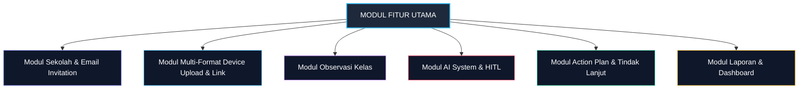

# 04 — Feature Modules

## 1. Daftar Modul Fitur Aplikasi

Sistem Supervisi Guru terdiri dari modul-modul fitur utama sebagai berikut:

---

## 2. Deskripsi Rinci Modul

### 2.1 Modul Manajemen Sekolah & User Invitation (Closed Onboarding)
- **Fungsi:** Mengelola master data sekolah dan alur pendaftaran hirarki pengguna melalui email invitation.
- **Fitur Utama:**
  - *Input Master Sekolah (Prasyarat):* Pengurus memasukkan data sekolah dampingan (NPSN, Nama Sekolah, Alamat) sebagai wadah utama.
  - *Invitasi Kepala Sekolah via Email:* Pengurus mendaftarkan & mengundang Kepala Sekolah dengan tautan token terenkripsi.
  - *Invitasi Guru via Email:* Kepala Sekolah (atau Pengurus) mendaftarkan & mengundang Guru-Guru di sekolahnya.
  - *Account Activation & Profile Manager:* Halaman aktivasi akun via email token untuk membuat kata sandi dan melengkapi NIP/Mapel.
  - *Penugasan Pengawas ke Sekolah:* Menghubungkan 1 pengawas dengan N sekolah.
  - *Manajemen Periode Supervisi:* Mengatur tahun ajaran dan semester aktif supervisi.

### 2.2 Modul Upload Berkas Perangkat Pembelajaran Multiformat
- **Fungsi:** Mengelola inventaris, pengunggahan berkas, dan status kelengkapan dokumen persiapan mengajar guru dalam berbagai format.
- **Fitur Utama:**
  - *Direct Multi-Format File Upload:* Guru dapat mengunggah berkas secara langsung dalam **berbagai format (DOCX, PDF, XLSX/Excel, PPTX/PPT, Gambar/Scan, TXT)**.
  - *Google Drive Public Link Integration:* Alternatif penautan folder atau file Google Drive publik (*Anyone with the link can view*).
  - *Master Jenis Perangkat (Configurable):* Kategori perangkat seperti RPP, Modul Ajar, Bahan Ajar, LKPD, Asesmen, Prota/Promes.
  - *Document Multi-Parser Engine:* Ekstraksi teks dari PDF, Word, Excel, PowerPoint, dan OCR Scan untuk disetorkan ke AI Engine.
  - *Status Verifikasi:* Menyimpan status verifikasi manusia (`Draft`, `AI Recommended`, `Verified`, `Need Revision`).

### 2.3 Modul Observasi Pembelajaran (Class Observation)
- **Fungsi:** Memfasilitasi pengamatan dan penilaian kinerja mengajar di kelas secara langsung.
- **Fitur Utama:**
  - *Manajemen Instrumen Fleksibel:* Pembuatan dan pengeditan instrumen observasi oleh Pengawas/Kepsek.
  - *Indikator Pembelajaran Mendalam (Deep Learning Approach):* Pemetaan fokus observasi.
  - *Skala Penilaian Konfigurasional:* Dukungan skala penilaian 1–3 atau 1–4.
  - *Catatan Kualitatif per Indikator:* Input catatan lapangan untuk setiap butir penilaian.
  - *Kalkulasi Skor Otomatis:* Perhitungan instan total skor perolehan dan persentase ketercapaian.

### 2.4 Modul AI System & Human Verification
- **Fungsi:** Membantu analisis otomatis dari berkas yang diunggah dan memberikan draf rekomendasi.
- **Fitur Utama:**
  - *AI Multi-Format Device Analyzer:* Menganalisis kelengkapan komponen perangkat dari file DOCX, PDF, Excel, PPT, maupun GDrive Link.
  - *AI Observation Synthesizer:* Menganalisis pola kelebihan dan area perbaikan dari hasil observasi.
  - *AI Follow-up Generator:* Menghasilkan draf aksi tindak lanjut.
  - *Human Verification Interface:* Antarmuka bagi Pengawas/Kepsek untuk menerima, mengedit, atau menolak masukan AI.

### 2.5 Modul Tindak Lanjut Supervisi (Follow-Up Management)
- **Fungsi:** Memantau pelaksanaan rekomendasi pasca-supervisi.
- **Fitur Utama:**
  - *Action Plan Builder:* Menyusun daftar item tindakan, penanggung jawab, dan tenggat waktu.
  - *Status Tracker:* Memantau progres (`Draft`, `Approved`, `In Progress`, `Completed`).

### 2.6 Modul Dashboard & Reporting
- **Fungsi:** Menyajikan statistik agregat dan dokumen cetak akhir.
- **Fitur Utama:**
  - *Dashboard Pengawas:* Overview lintas sekolah dampingan.
  - *Dashboard Kepala Sekolah:* Overview seluruh guru di sekolah terkait.
  - *Report Generator:* Penyusunan Laporan Supervisi Guru yang dapat diunduh (PDF/Format resmi).

