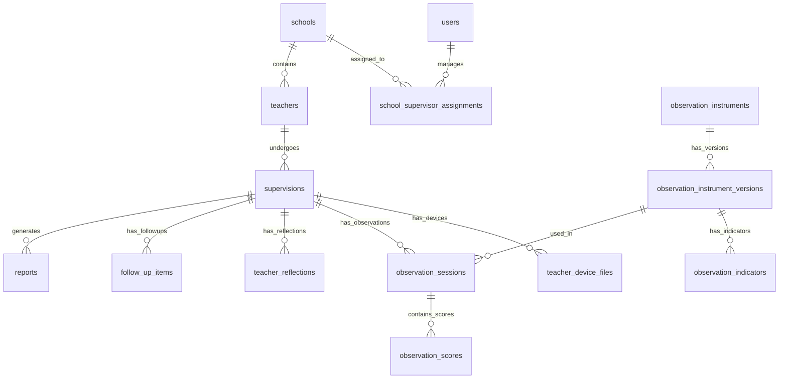

# 05 — Domain Model & Data Schema Concepts

## 1. Skema Entitas Konseptual

Berikut adalah entitas domain utama yang dibutuhkan oleh aplikasi supervisi:

---

## 2. Daftar Entitas & Kolom Kunci (Draf Domain)

> **Catatan:** Nama tabel dan struktur di bawah adalah **konsep domain**, dapat disesuaikan dengan ORM / database engine yang dipilih (PostgreSQL, MySQL, Prisma, TypeORM, dll.).

### 2.1 Management & Access
- **`users`**: `id`, `name`, `email`, `password_hash`, `role` (`SUPERVISOR`, `PRINCIPAL`, `TEACHER`), `account_status` (`PENDING_INVITATION`, `EXPIRED`, `ACTIVE`, `SUSPENDED`), `invitation_token`, `invitation_sent_at`, `invited_by_user_id`, `school_id`, `created_at`.
- **`schools`**: `id`, `npsn`, `name`, `address`, `created_by_user_id` (Pengawas yang membuat data sekolah).
- **`school_supervisor_assignments`**: `id`, `supervisor_id`, `school_id`, `assigned_at`.
- **`teachers`**: `id`, `user_id`, `school_id`, `nip`, `subject_taught`, `grade_level`.

### 2.2 Supervisi & Perangkat Pembelajaran
- **`supervision_periods`**: `id`, `name` (misal: Semester Ganjil 2026/2027), `start_date`, `end_date`, `is_active`.
- **`supervisions`**: `id`, `teacher_id`, `period_id`, `status` (`DRAFT`, `IN_PROGRESS`, `COMPLETED`), `created_at`.
- **`device_types`**: `id`, `code`, `name` (Modul Ajar, RPP, LKPD, dll.), `is_required`, `description`.
- **`teacher_device_files`**: `id`, `supervision_id`, `device_type_id`, `upload_type` (`DIRECT_UPLOAD`, `GDRIVE_LINK`), `file_path` (path internal storage), `file_format` (`pdf`, `docx`, `xlsx`, `pptx`, `png`, `gdrive_link`), `gdrive_public_url`, `file_name`, `file_size_bytes`, `ai_analysis_json`, `ai_recommendation_text`, `human_review_status` (`PENDING`, `APPROVED`, `REJECTED`, `CORRECTED`), `reviewer_notes`, `verified_by_user_id`, `verified_at`.

### 2.3 Observasi & Refleksi Guru
- **`observation_instruments`**: `id`, `title`, `description`, `scale_min` (1), `scale_max` (3 atau 4), `is_active`.
- **`observation_instrument_versions`**: `id`, `instrument_id`, `version_number`, `created_at`.
- **`observation_indicators`**: `id`, `version_id`, `category` (misal: *Pembelajaran Mendalam*), `indicator_text`, `order_index`.
- **`observation_sessions`**: `id`, `supervision_id`, `instrument_version_id`, `observer_user_id`, `observation_date`, `total_score`, `max_score`, `percentage`, `ai_summary_text`, `status`.
- **`observation_scores`**: `id`, `session_id`, `indicator_id`, `score`, `notes`.
- **`teacher_reflections`**: `id`, `supervision_id`, `teacher_id`, `strengths_text`, `challenges_text`, `improvement_areas_text`, `support_needed_text`, `status` (`DRAFT`, `SUBMITTED`), `submitted_at`.

### 2.4 AI & Tindak Lanjut
- **`ai_logs`**: `id`, `supervision_id`, `prompt_context`, `ai_response_json`, `model_name`, `created_at`.
- **`follow_up_items`**: `id`, `supervision_id`, `ai_suggested_action`, `final_action`, `assigned_to_user_id`, `deadline`, `status` (`DRAFT`, `APPROVED`, `IN_PROGRESS`, `COMPLETED`), `notes` (mempertimbangkan hasil observasi & refleksi guru).
- **`reports`**: `id`, `supervision_id`, `file_url`, `generated_at`, `generated_by_user_id`.
- **`audit_logs`**: `id`, `user_id`, `action`, `resource_name`, `resource_id`, `payload_before`, `payload_after`, `created_at`.

---

## 3. Prinsip Versioning Instrumen & Audit Trail

### 3.1 Versioning Instrumen Observasi
- Instrumen observasi **tidak boleh langsung ditimpa (in-place update)** jika sudah pernah digunakan dalam sesi observasi yang sudah selesai.
- Perubahan pada indikator atau skala wajib membuat **versi baru (`observation_instrument_versions`)**.
- Hasil observasi lama akan selalu merujuk pada versi instrumen pada saat observasi dilaksanakan.

### 3.2 Immutability Historical Supervision
- Catatan dan skor observasi periode lalu bersifat read-only untuk menjaga integritas data historis supervisi.

### 3.3 Audit Trail Kunci
Tindakan berikut wajib mencatat `audit_logs`:
- Perubahan status verifikasi perangkat pembelajaran oleh manusia.
- Pengeditan/penyesuaian skor observasi yang telah difinalisasi.
- Persetujuan program tindak lanjut.
- Pencetakan/penjanaan laporan resmi.
