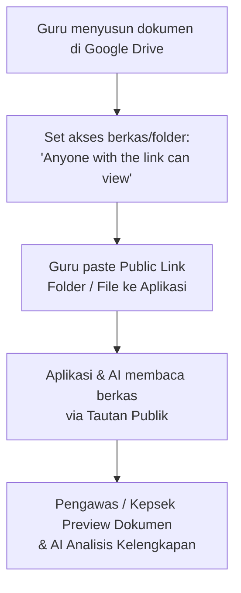
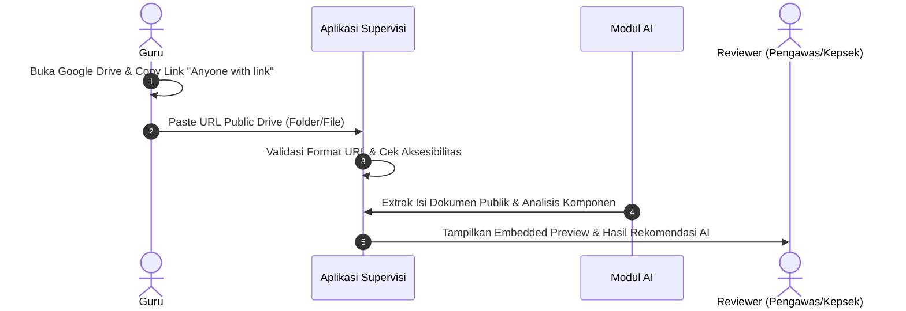

# 06 — Google Drive Integration (Public Link Model)

## 1. Konsep Penautan Google Drive via Public Link

> **Koreksi Konteks:** Aplikasi **TIDAK menggunakan OAuth2 API Google Drive** kompleks.
> Guru **tidak perlu mengintegrasikan akun Google secara OAuth**.
> Sebagai gantinya, Guru menyimpan dokumen perangkat pembelajaran di Google Drive masing-masing, mengatur hak akses berkas/folder menjadi **"Anyone with the link can view" (Siapa saja yang memiliki link dapat melihat)**, lalu menempelkan (paste) tautan/link publik tersebut ke aplikasi.

---

## 2. Alur Penggunaan & Penyediaan Tautan

---

## 3. Keunggulan & Batasan Model Public Link

### Keunggulan:
- **Tanpa OAuth Complex:** Tidak membutuhkan registrasi Google App Console, verifikasi OAuth, atau manajemen refresh token yang rumit.
- **Sederhana bagi Guru:** Guru hanya perlu mengopi tautan berbagi yang sudah biasa mereka gunakan.
- **Privasi Terkontrol:** Guru memegang kendali penuh atas folder/berkas apa yang dibagikan melalui link.

### Ketentuan & Batasan:
- **Pengaturan Izin Akses:** Guru wajib memastikan pengaturan berbagi berkas/folder di Google Drive sudah benar (*Anyone with the link can view*). Jika link bersifat privat, sistem/AI dan Pengawas tidak akan bisa mengakses dokumen tersebut.
- **Deteksi Link Privat:** Aplikasi perlu memberikan peringatan jika tautan yang dimasukkan tidak dapat diakses secara publik.
