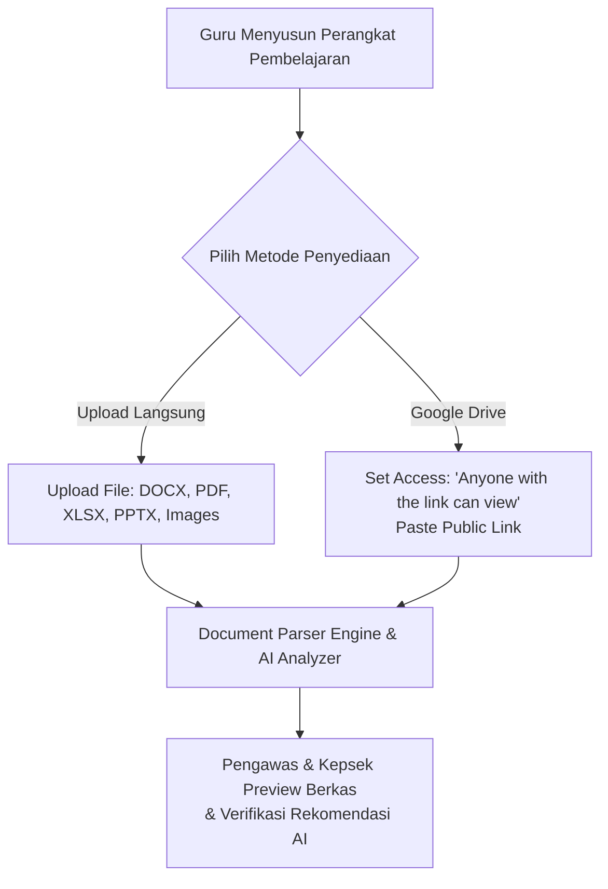
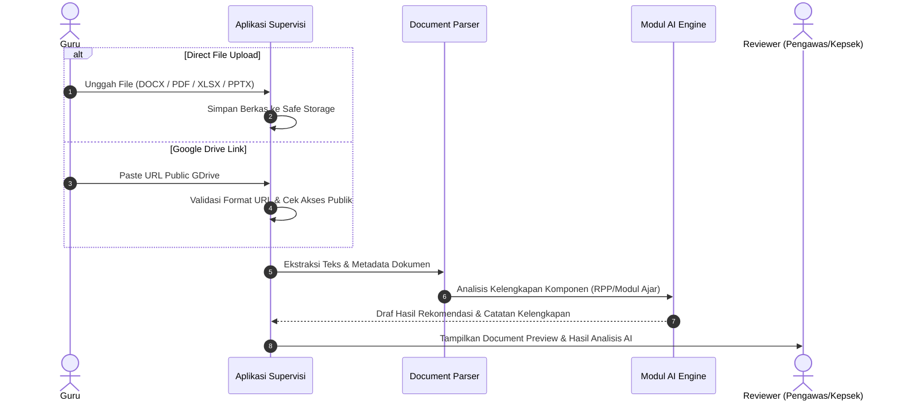

# 06 — Direct Upload & Google Drive Integration

## 1. Konsep Penyediaan Berkas Perangkat Pembelajaran

Sistem Supervisi Akademik Guru memberikan **fleksibilitas penuh** bagi Guru dalam menyediakan dokumen perangkat pembelajaran. Guru dapat menggunakan 2 saluran utama:

1. **Direct Multi-Format File Upload (Upload Berkas Langsung):**
   - Guru dapat mengunggah berkas secara langsung dari komputer atau ponsel pintar.
   - Format yang didukung meliputi: **PDF (`.pdf`)**, **Microsoft Word (`.docx`, `.doc`)**, **Microsoft Excel (`.xlsx`, `.xls`)**, **Microsoft PowerPoint (`.pptx`, `.ppt`)**, **Gambar/Scan (`.png`, `.jpg`, `.jpeg`)**, serta berkas teks.
2. **Google Drive Public Shared Link (Tautan Publik):**
   - Guru yang terbiasa menggunakan Google Drive dapat menempelkan (paste) tautan berkas/folder yang telah diset hak aksesnya menjadi **"Anyone with the link can view" (Siapa saja yang memiliki link dapat melihat)**.
   - Aplikasi tidak memerlukan integrasi OAuth2 Google Drive yang rumit.

---

## 2. Alur Pengunggahan & Pemrosesan Berkas

---

## 3. Spesifikasi Dukungan Format & Ketentuan Technical

### 3.1 Format Berkas Terdukung
| Ekstensi | Deskripsi Format | Parser Engine Backend |
| :--- | :--- | :--- |
| `.pdf` | Adobe Portable Document Format | PDF Text Extractor / OCR |
| `.docx` / `.doc` | Microsoft Word Document | DOCX XML Parser |
| `.xlsx` / `.xls` | Microsoft Excel Spreadsheet | Sheet/Table Text Extractor |
| `.pptx` / `.ppt` | Microsoft PowerPoint Presentation | PPT Slide Text Parser |
| `.png` / `.jpg` | Gambar Scan / Infografis Perangkat | Optical Character Recognition (OCR) / Vision AI |
| `GDrive Link` | Tautan Folder / File Google Drive | Web Scraper / Public Drive API Reader |

### 3.2 Ketentuan & Batasan:
- **Ukuran Maksimum File Direct Upload:** Batas standar 25 MB per berkas (dapat dikonfigurasi pada server/storage).
- **Pengaturan Akses Link Google Drive:** Guru wajib memastikan tautan Google Drive berstatus *Anyone with the link can view*. Sistem akan menampilkan peringatan jika tautan bersifat privat/terkunci.

