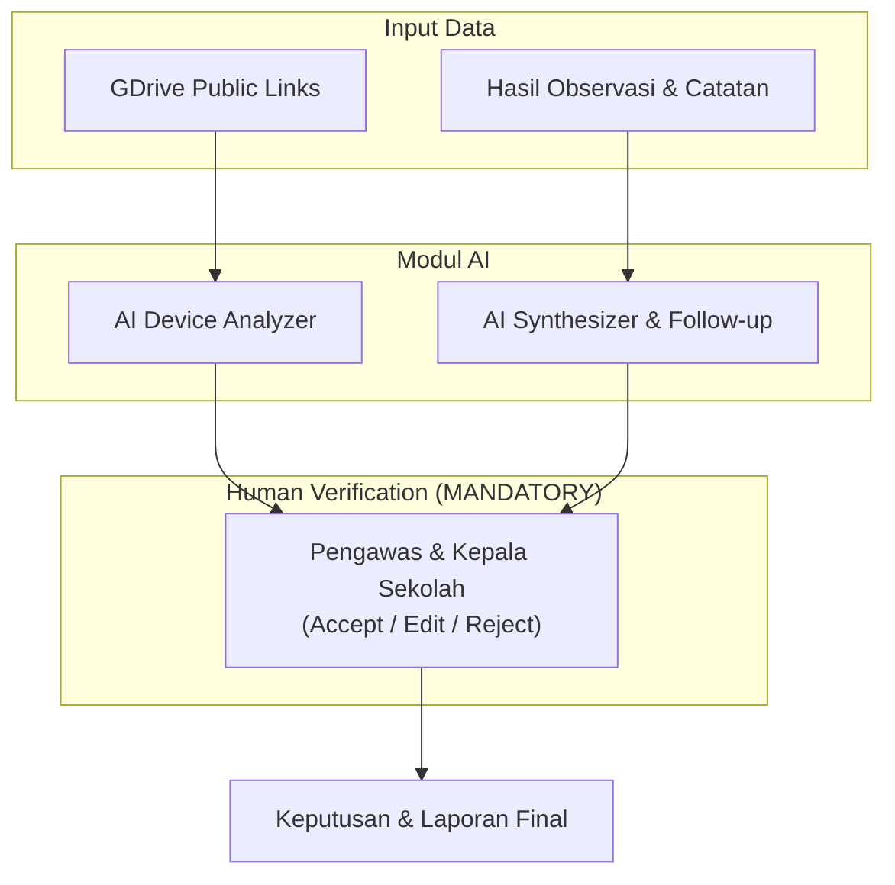

# 07 — AI System & Human-in-the-Loop Architecture

## 1. Peran AI dalam Sistem Supervisi

AI difungsikan sebagai **Co-Pilot / Asisten Kerja Intelijen** bagi Pengawas dan Kepala Sekolah. AI membantu mempercepat pemeriksaan dokumen dan pengolahan data observasi, namun **TIDAK MENGAMBIL KEPUTUSAN FINAL**.



---

## 2. Fitur-Fitur Utama Modul AI

### 2.1 AI Analisis Perangkat Pembelajaran
- **Input:** Berkas dokumen guru dari Google Drive Public Link.
- **Output AI:**
  - Jumlah dokumen yang teridentifikasi.
  - Pemetaan berkas ke jenis perangkat (RPP, Modul Ajar, Asesmen, LKPD, dll.).
  - Indikator kelengkapan struktur modul (tujuan pembelajaran, langkah kegiatan, asesmen).
  - Catatan draf kualitas dan komponen yang kurang lengkap.

### 2.2 AI Synthesizer & Rekomendasi Tindak Lanjut
- **Input:**
  - Hasil verifikasi perangkat pembelajaran.
  - Hasil observasi kelas (skor per indikator & catatan observer).
- **Output AI:**
  - Ringkasan kekuatan dan area yang perlu ditingkatkan dari guru.
  - Rekomendasi bentuk tindak lanjut (misal: "Penguatan penyusunan instrumen asesmen formatif", "Pelatihan strategi pembelajaran aktif").

---

## 3. Prinsip Human-in-the-Loop (MANDATORY)

Sistem wajib menerapkan alur **Human-in-the-Loop (HITL)** pada seluruh titik integrasi AI:

```mermaid
stateDiagram-v2
    [*] --> AI_Draft: AI Generate Output
    AI_Draft --> Human_Review: Presented to Reviewer
    Human_Review --> Accepted: Reviewer Klik Accept
    Human_Review --> Corrected: Reviewer Edit/Koreksi
    Human_Review --> Rejected: Reviewer Tolak Output AI
    Accepted --> Final_Result
    Corrected --> Final_Result
    Rejected --> Manual_Input --> Final_Result
```

### Aturan Review Manusia:
1. **Dua Layer Status:**
   - `AI Result`: Menyimpan output asli dari AI beserta timestamp dan versi model.
   - `Verified Result`: Menyimpan hasil keputusan manusia yang dapat berbeda dari output AI.
2. **Review Actions:** Reviewer (Pengawas / Kepsek) dapat memilih:
   - **Accept:** Menerima rekomendasi AI tanpa perubahan.
   - **Correct / Edit:** Mengubah teks, skor, atau rekomendasi AI.
   - **Reject:** Menolak saran AI dan memasukkan penilaian/rekomendasi manual.
3. **Traceability:** Tampilan UI harus menampilkan penanda yang jelas antara status `Rekomendasi AI` vs `Diverifikasi Pengawas/Kepsek`.

---

## 4. Keamanan & Privacy AI

- **No Hardcoded Prompts:** Prompt AI harus terisolasi dalam modul/service khusus agar mudah diperbarui.
- **Sensitif Data Filtering:** Data pribadi yang sensitif harus difilter sebelum dikirim ke API Provider AI.
- **Fallback Manual:** Apabila service AI tidak tersedia atau mengalami kegagalan, workflow supervisi **harus tetap dapat berjalan secara manual** tanpa hambatan.
