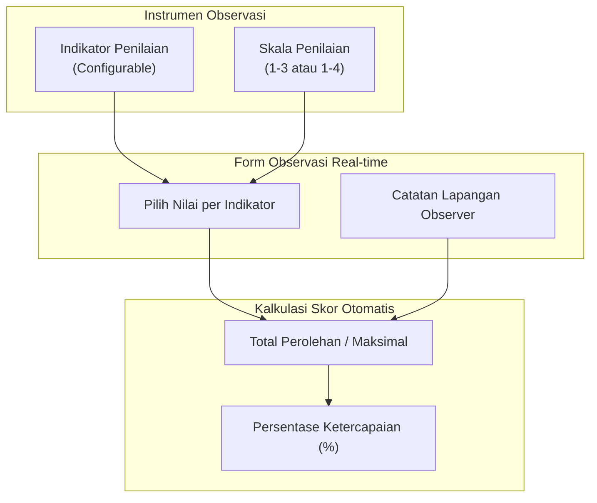

# 08 — Observation System & Scoring

## 1. Konsep Sistem Observasi Pembelajaran

Observasi pembelajaran dilaksanakan ketika Pengawas atau Kepala Sekolah melakukan pengamatan langsung kegiatan belajar mengajar di kelas.

Sistem observasi menyediakan antarmuka pengisian instrumen berbasis web/mobile-friendly yang dinamis dan fleksibel.



---

## 2. Manajemen Instrumen Observasi Fleksibel

Berdasarkan kebutuhan pengguna:

> Pengawas dan Kepala Sekolah diberikan kebebasan untuk memasukkan instrumen penilaian sendiri yang akan menjadi penilai kunjungan di dalam kelas.

### Ketentuan Instrumen:
1. **Configurable Indicators:** Jumlah indikator bersifat dinamis (tidak di-hardcode 12 indikator).
2. **Kategori / Domain Penilaian:** Indikator dapat dikelompokkan ke dalam kategori tertentu, misalnya **Pendekatan Pembelajaran Mendalam (Deep Learning Approach)**, Manajemen Kelas, Interaksi Siswa, dll.
3. **Versi Instrumen (Versioning):** Perubahan indikator akan menghasilkan versi instrumen baru agar histori observasi sebelumnya tidak rusak.

---

## 3. Skala Penilaian & Catatan per Indikator

### 3.1 Skala Penilaian
Sistem mendukung konfigurasi rentang skala penilaian:
- **Skala 1–4:** `1 = Kurang`, `2 = Cukup`, `3 = Baik`, `4 = Sangat Baik`
- **Skala 1–3:** `1 = Belum Nampak`, `2 = Mulai Nampak`, `3 = Sudah Pembiasaan`

### 3.2 Catatan Kualitatif per Indikator
Setiap item indikator penilaian dilengkapi dengan kolom **Catatan Observer**.
- Contoh:
  ```text
  Indikator: Guru melibatkan peserta didik secara aktif dalam diskusi kelompok.
  Skor     : 4 (Sangat Baik)
  Catatan  : Peserta didik sangat antusias, diskusi kelompok berjalan efektif.
  ```

---

## 4. Formulasi Akumulasi Skor & Presentasi Hasil

### 4.1 Rumus Perhitungan Nilai Akhir Observasi

$$\text{Nilai Akhir (\%)} = \left( \frac{\sum \text{Skor Perolehan Indikator}}{\sum \text{Skor Maksimal Indikator}} \right) \times 100\%$$

*Contoh Kasus (12 Indikator, Skala Maksimal 4):*
- Total Skor Maksimal = $12 \times 4 = 48$
- Total Skor Perolehan = $41$
- Persentase Akhir = $\left(\frac{41}{48}\right) \times 100\% = 85{,}42\%$

### 4.2 Penyimpanan Data Observasi
Satu guru dapat memiliki **banyak riwayat observasi** dalam satu tahun ajaran (misal: Observasi Awal, Observasi Lanjutan, Observasi Akhir). Setiap riwayat wajib mencatat:
- Tanggal observasi & Jam pelaksanaan.
- Observer (Pengawas atau Kepala Sekolah).
- Versi instrumen yang digunakan.
- Detail skor dan catatan per indikator.
- Total skor, nilai maksimal, dan persentase akhir.
- Catatan umum observer.

---

## 5. Tahap Refleksi Diri Guru Pasca-Observasi Kelas

### 5.1 Definisi & Tujuan
Setelah kegiatan observasi kelas diisi oleh observer (Pengawas/Kepsek), Guru melakukan **Refleksi Diri Pasca-Observasi**. Refleksi ini bertujuan agar penilaian supervisi tidak bersifat satu arah (top-down), melainkan menjadi ruang dialog emansipatif untuk perbaikan pembelajaran.

### 5.2 Komponen Form Refleksi Guru:
1. **Hal Baik / Kekuatan:** Catatan guru mengenai aspek pengajaran yang telah berhasil dilaksanakan dengan baik di kelas.
2. **Tantangan / Kendala:** Kesulitan atau hambatan yang ditemui guru selama mengajar (misal: pengelolaan waktu, dinamika siswa, sarana).
3. **Area Pengembangan:** Aspek kompetensi atau metode mengajar yang ingin ditingkatkan oleh guru secara mandiri.
4. **Kebutuhan Dukungan:** Bentuk bantuan, fasilitas, atau pelatihan yang diharapkan guru dari Kepala Sekolah/Pengawas.

### 5.3 Peran Refleksi dalam Kegiatan Tindak Lanjut
- Data refleksi diri guru **disandingkan secara otomatis dengan skor & catatan observer** dalam modul analisis.
- AI Synthesizer membaca data refleksi ini sebagai variabel masukan utama guna menyusun draf **Rencana Tindak Lanjut Supervisi**.
- Pengawas dan Kepala Sekolah mempertimbangkan aspirasi serta kebutuhan dukungan guru saat mengesahkan program tindak lanjut akhir.
