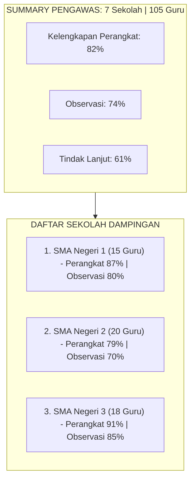
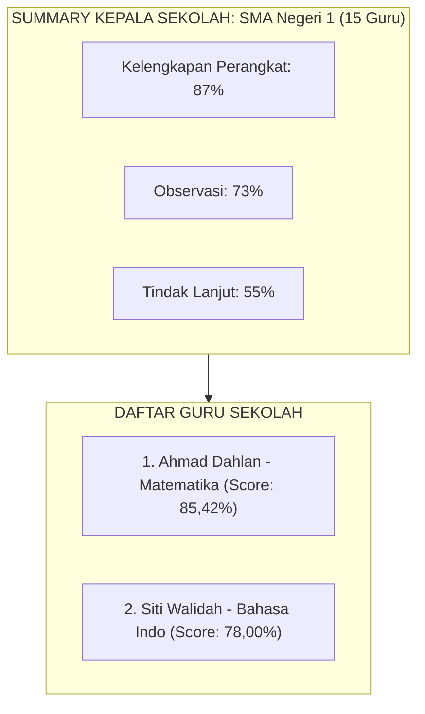
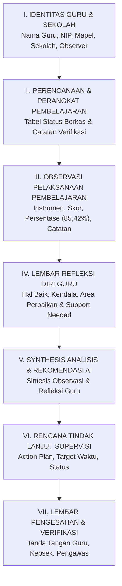

# 09 — Dashboard & Reporting

## 1. Dashboard Supervisi Multi-Role

Dashboard menyajikan statistik dan perkembangan proses supervisi disesuaikan dengan hak akses dan cakupan role pengguna.

### 1.1 Dashboard Pengawas Sekolah (Overview Multi-Sekolah)
Menampilkan statistik agregat dari **seluruh sekolah dampingan** yang berada di bawah pengawasannya.

- **Fitur Tambahan:**
  - Tombol *Add Sekolah Manual* untuk menambah sekolah baru.
  - Filter berdasarkan periode supervisi / tahun ajaran.

### 1.2 Dashboard Kepala Sekolah (Overview Single-Sekolah)
Menampilkan perkembangan supervisi dari **seluruh guru di sekolahnya saja**.

---

## 2. Spesifikasi Laporan Akhir Supervisi

Output akhir dari seluruh rangkaian siklus supervisi adalah **Laporan Supervisi Akademik Guru**.

### 2.1 Struktur Konten Laporan Supervisi
Laporan supervisi merangkum seluruh perjalanan dari perencanaan hingga tindak lanjut:

### 2.2 Format Output & Unduh
- **Dukungan Format:** Draf laporan dapat dilihat secara langsung di web (*Interactive View*) dan diunduh sebagai dokumen berkas **PDF**.
- **Fitur Kop & Identitas:** Dokumen mendukung penggunaan kop surat resmi sekolah/dinas dan kolom tanda tangan pengesahan.
