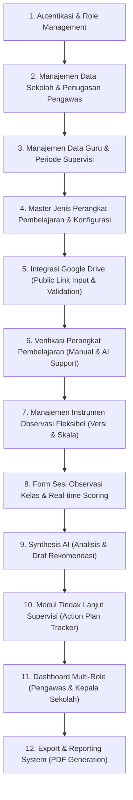

# 10 — Implementation Guidelines & Phasing

## 1. Prioritas & Tahapan Implementasi

Untuk memastikan proses pengembangan berjalan secara terstruktur dan bertahap, urutan implementasi modul yang direkomendasikan adalah sebagai berikut:



---

## 2. Panduan Fleksibilitas Arsitektur (Anti Hard-Coding Rules)

Beberapa area aplikasi memerlukan fleksibilitas tinggi karena requirement dapat berkembang seiring tanggapan client:

### 2.1 Master Jenis Perangkat Pembelajaran
- **Jangan Melakukan Hardcoding Jenis Berkas:**
  ```typescript
  // BAD:
  if (fileType === 'RPP' || fileType === 'MODUL_AJAR') { ... }
  ```
- **Gunakan Database/Config Driven:**
  ```typescript
  // GOOD:
  const deviceType = await db.deviceTypes.findUnique({ where: { id } });
  ```

### 2.2 Instrumen Penilaian Observasi
- **Jangan Mengunci Jumlah Indikator:**
  Meskipun contoh diskusi menyebut 12 indikator, bentuk instrumen harus menggunakan struktur *array/list* indikator yang panjangnya dinamis.
- **Jangan Mengunci Skala Penilaian:**
  Dukung konfigurasi rentang nilai (1–3 atau 1–4) melalui metadata instrumen.

### 2.3 Formulasi Kategori Hasil & Predikat
- Nilai persentase akhir (misal 85,42%) harus dihitung dengan formula matematika yang bersih. Predikat kualitatif (Sangat Baik, Baik, Cukup) harus diambil dari tabel konfigurasi batas nilai (*grade threshold*).

---

## 3. Strategi Pengujian (Testing & Verification Plan)

- **Unit Testing:**
  - Formula perhitungan persentase observasi.
  - Pembatasan otorisasi scope data (Supervisor multi-school vs Principal single-school).
- **Integration Testing:**
  - Mocking URL validator & Google Drive public preview link.
  - Mocking AI Service response & alur Human Verification.
- **Manual Verification:**
  - Simulasi alur end-to-end supervisi guru dari koneksi Drive hingga pembuatan laporan PDF.
