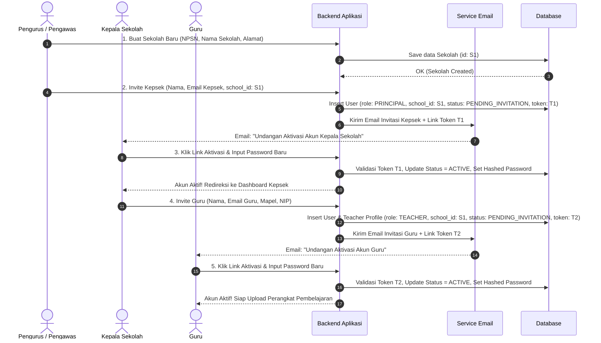
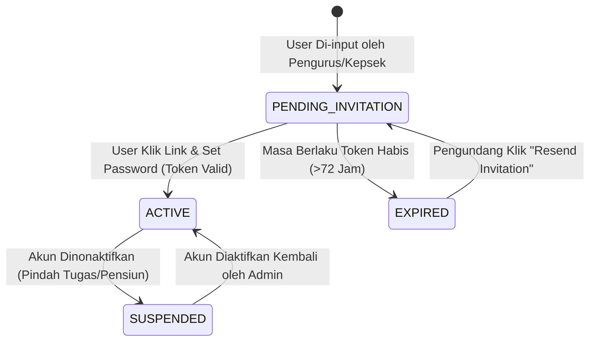

# 13 — User Registration & Invitation Workflow

## 1. Prinsip Utama Registrasi & Hirarki Akun

Aplikasi **Sistem Supervisi Akademik Guru** menerapkan model **Closed Hierarchy Onboarding** dengan pengontrolan ketat. Untuk menjaga validitas data sekolah dan keamanan sistem, **pendaftaran mandiri secara terbuka (open self-registration) TIDAK DIIZINKAN**.

 Seluruh akun pengguna baru (Kepala Sekolah dan Guru) dibuat melalui **Mekanisme Invitasi Email (Email Invitation Workflow)** yang dipicu oleh tingkatan peran di atasnya.

```mermaid
graph TD
    SYS["System Seed / Superadmin"] -->|Dibuat saat inisialisasi| P["Pengurus / Pengawas<br/>(Admin System / Multi-Sekolah)"]
    P -->|1. Wajib Buat Sekolah Dulu| S["Sekolah A<br/>(Tenant / Wadah Data)"]
    P -->|2. Invite via Email| KS["Kepala Sekolah<br/>(Single-Sekolah)"]
    KS -->|3. Invite via Email| G1["Guru 1"]
    KS -->|3. Invite via Email| G2["Guru 2"]
    P -.->|3. Invite via Email (Bantuan Admin)| G3["Guru 3"]

    style SYS fill:#1e293b,stroke:#38bdf8,stroke-width:2px,color:#fff
    style P fill:#0f172a,stroke:#818cf8,stroke-width:2px,color:#fff
    style S fill:#1e293b,stroke:#fbbf24,stroke-width:2px,color:#fff
    style KS fill:#0f172a,stroke:#c084fc,stroke-width:2px,color:#fff
    style G1 fill:#0f172a,stroke:#38bdf8,stroke-width:1px,color:#fff
    style G2 fill:#0f172a,stroke:#38bdf8,stroke-width:1px,color:#fff
    style G3 fill:#0f172a,stroke:#38bdf8,stroke-width:1px,color:#fff
```

---

## 2. Prasyarat Wajib: Pembuatan Sekolah Terlebih Dahulu

> **PRASYARAT MUTLAK:** Sebelum Pengurus atau Kepala Sekolah dapat mendaftarkan/mengundang siapapun, **Pengurus (Pengawas / Admin System) WAJIB membuat data Sekolah terlebih dahulu** di dalam aplikasi.

### Alasan Arsitektur:
1. **Multi-Tenancy Container:** Sekolah bertindak sebagai entitas wadah (container/tenant) untuk memisahkan data guru, perangkat pembelajaran, dan riwayat observasi.
2. **Relasi Entitas Mandatori:** Setiap akun Kepala Sekolah dan Guru **wajib terikat (bound) pada 1 `school_id`**. Tanpa entitas Sekolah, akun Kepala Sekolah dan Guru tidak dapat dinisialisasi dalam basis data.

---

## 3. Rincian Alur Penambahan & Invitasi per Peran

### 3.1 Penambahan Akun Pengurus / Pengawas (System Admin)
- **Metode Pendaftaran:** Dibuat langsung oleh sistem (*System Seed*) saat inisialisasi basis data awal atau ditambahkan oleh Superadmin / Dinas Pendidikan.
- **Kewenangan Pendaftaran:**
  - Membuat & mengelola Master Data Sekolah (`schools`).
  - Mengundang Kepala Sekolah untuk sekolah mana pun.
  - Mengundang Guru secara langsung ke sekolah terkait (opsional/bantuan administrasi).

### 3.2 Penambahan & Invitasi Kepala Sekolah (by Pengurus)
1. **Pengurus** masuk ke dashboard aplikasi dan membuka menu **Manajemen Sekolah & Pengguna**.
2. **Pengurus** memilih Sekolah terkait (atau membuat Sekolah baru jika belum ada).
3. **Pengurus** memasukkan data Kepala Sekolah: **Nama Lengkap**, **Alamat Email**, dan **NIP** (opsional).
4. **Sistem** mencatat draf entitas user dengan status `PENDING_INVITATION` dan men-generate **Token Invitasi Unik** (berlaku misal 72 jam).
5. **Sistem** mengirimkan **Email Invitasi** ke alamat email Kepala Sekolah yang berisi link aktivasi akun:
   `https://app.supervisi.id/accept-invite?token=SECURE_TOKEN_STRING`
6. **Kepala Sekolah** membuka email, mengklik link aktivasi, membuat Kata Sandi (password) baru, dan melengkapi data profil.
7. **Status Akun** berubah menjadi `ACTIVE`. Kepala Sekolah kini memiliki akses penuh ke dashboard sekolahnya.

### 3.3 Penambahan & Invitasi Guru (by Kepala Sekolah atau Pengurus)
1. **Kepala Sekolah** (atau Pengurus) masuk ke aplikasi dan membuka menu **Manajemen Guru**.
2. Pengundang memasukkan data Guru: **Nama Lengkap**, **Alamat Email**, **NIP/NUPTK**, **Mata Pelajaran yang Diampu**, dan **Tingkat Kelas**.
3. **Sistem** mencatat entitas guru terkait `school_id` sekolah tersebut dengan status `PENDING_INVITATION`.
4. **Sistem** mengirimkan **Email Invitasi** ke alamat email Guru.
5. **Guru** membuka email, mengklik link token aktivasi, membuat Kata Sandi baru, dan memverifikasi profilnya.
6. **Status Akun** berubah menjadi `ACTIVE`. Guru kini dapat masuk ke aplikasi dan mulai mengunggah/menautkan berkas perangkat pembelajaran.

---

## 4. Diagram Urutan Skenario End-to-End Invitasi (Sequence Diagram)



---

## 5. Siklus Hidup Status Akun (Account Status Lifecycle)



### Penjelasan Status:
1. **`PENDING_INVITATION`**:
   - Akun telah dicatat dalam basis data, email invitation telah dikirimkan, namun pengguna belum membuat kata sandi.
   - Pengguna belum dapat melakukan login biasa.
2. **`EXPIRED`**:
   - Token aktivasi yang dikirimkan telah melebihi batas waktu (default 72 jam).
   - Pengguna tidak dapat mengaktifkan akun via token lama dan akan melihat pesan "Link Kedaluwarsa".
   - Pengundang (Pengurus/Kepsek) dapat mengklik tombol **"Kirim Ulang Undangan" (Resend Invite)** di dashboard untuk men-generate token baru dan mengirim ulang email.
3. **`ACTIVE`**:
   - Pengguna telah berhasil memverifikasi token, membuat kata sandi, dan siap menggunakan seluruh fitur aplikasi sesuai role-nya.
4. **`SUSPENDED`**:
   - Akun dibekukan sementara atau permanen (misal jika guru/kepsek mutasi atau pensiun). Pengguna tidak dapat masuk ke sistem.

---

## 6. Template Komunikasi Email Invitasi

### Template Email Invitasi Kepala Sekolah:
```text
Subjek: [Supervisi Akademik] Undangan Aktivasi Akun Kepala Sekolah - {Nama_Sekolah}

Halo {Nama_Kepala_Sekolah},

Anda telah didaftarkan oleh Pengawas Sekolah ({Nama_Pengawas}) sebagai Kepala Sekolah untuk {Nama_Sekolah} pada platform Sistem Supervisi Akademik Berbasis AI.

Silakan selesaikan pendaftaran dan buat kata sandi akun Anda melalui tautan di bawah ini:
[Aktivasi Akun Kepala Sekolah] -> https://app.supervisi.id/accept-invite?token={TOKEN_STRING}

Tautan ini berlaku selama 72 jam. Apabila tautan kedaluwarsa, hubungi Pengawas Sekolah Anda untuk mendapatkan tautan undangan baru.

Terima kasih,
Tim Supervisi Akademik
```

### Template Email Invitasi Guru:
```text
Subjek: [Supervisi Akademik] Undangan Aktivasi Akun Guru - {Nama_Sekolah}

Halo {Nama_Guru},

Kepala Sekolah Anda ({Nama_Kepala_Sekolah}) mengundang Anda untuk bergabung ke dalam Sistem Supervisi Akademik Guru {Nama_Sekolah}.

Untuk memulai mengunggah dokumen perangkat pembelajaran dan memantau riwayat supervisi Anda, silakan aktifkan akun Anda melalui tautan berikut:
[Aktivasi Akun Guru] -> https://app.supervisi.id/accept-invite?token={TOKEN_STRING}

Tautan ini berlaku selama 72 jam.

Terima kasih,
Tim Supervisi Akademik
```

---

## 7. Keamanan & Penanganan Edge Cases

1. **Token Cryptographically Secure:** Token invitasi wajib dibuat menggunakan algoritma acak aman (seperti UUIDv4 / Cryptographic Random String minimal 32 karakter) dan di-hash saat disimpan di basis data.
2. **Rate Limiting Pengiriman Email:** Mencegah penyalahgunaan fitur *Resend Invitation* dengan membatasi maksimum 3 kali pengiriman email per jam per alamat email.
3. **Penyelarasan Domain / Email ganda:** Apabila email sudah terdaftar di sekolah lain, sistem memberikan opsi mutasi/penugasan ulang (bukan membuat akun duplikat).
4. **Validasi Profil Saat Aktivasi:** Saat aktivasi akun Guru, sistem mewajibkan pengisian NIP/NUPTK serta konfirmasi mata pelajaran agar data supervisi akurat.
