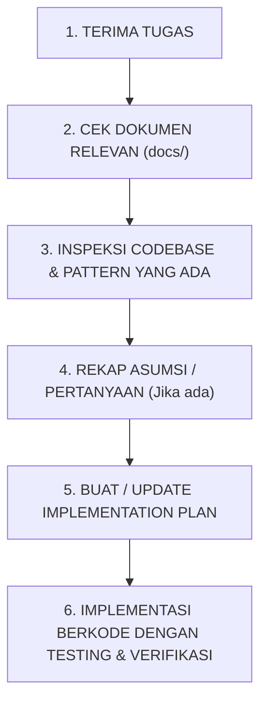

# Agent Context & Operating Rules — Sistem Supervisi Guru Berbasis AI

> **Dokumen ini ditujukan sebagai acuan utama bagi AI Coding Agent saat bekerja di repositori ini.**

---

## 1. Peran & Aturan Utama AI Agent

Sebagai AI Coding Agent yang bekerja pada repositori **Sistem Supervisi Guru**, Anda harus mematuhi prinsip-prinsip berikut:

### 1.1 Jangan Langsung Coding Berdasarkan Asumsi
- **Langkah Kerja Mandatory:**
  1. Baca seluruh dokumentasi di folder `docs/`.
  2. Pahami struktur repositori dan teknikal stack yang sudah ada.
  3. Pecah requirement menjadi sub-task kecil dan terisolasi.
  4. Identifikasi bagian yang ditandai sebagai `OPEN QUESTION` atau `DECISION REQUIRED`.
  5. Buat rencana implementasi sebelum mengeksekusi perubahan besar.

### 1.2 Jangan Mengarang Business Rule
- Jika suatu alur bisnis atau logika kalkulasi belum ditentukan secara eksplisit:
  - Tandai dan dokumentasikan sebagai `DECISION REQUIRED`.
  - Buat desain sistem yang **configurable** (dapat diatur lewat konfigurasi/database) alih-alih melakukan hard-coding.

### 1.3 Jangan Menganggap Angka Contoh Sebagai Aturan Baku
Semua angka contoh dalam dokumen requirement (seperti 7 sekolah, 15 guru, 11 perangkat, 12 indikator observasi, skala 1–4, persentase 85.42%) adalah **ilustrasi contoh**, bukan batasan atau nilai tetap. Sistem harus mendukung jumlah yang dinamis dan fleksibel.

### 1.4 Pisahkan Data AI dari Hasil Final
Output dari modul AI (analisis perangkat, ringkasan observasi, rekomendasi tindak lanjut) **selalu bersifat draft/saran** dan tidak boleh langsung menjadi keputusan final.
- `AI Generated` harus selalu dapat dibedakan dari `Human Verified`.
- Keputusan akhir selalu berada di tangan manusia (Pengawas / Kepala Sekolah).

### 1.5 Jangan Melakukan Rewrite Besar Tanpa Alasan
- Pertahankan arsitektur dan konvensi kode yang sudah ada dalam repositori.
- Lakukan refactoring secara bertahap dan teruji.

---

## 2. Peta Dokumentasi Proyek

Sebelum mulai mengerjakan fitur, agent wajib membaca dokumen berikut sesuai konteks tugas:

| Dokumen | Isi Utama |
| :--- | :--- |
| [README.md](file:///home/darbi/Projects/supervisi_sekolah/docs/README.md) | Indeks & Panduan Navigasi Dokumentasi |
| [01-gambaran-umum-produk.md](file:///home/darbi/Projects/supervisi_sekolah/docs/01-gambaran-umum-produk.md) | Visi Produk, Alur Utama, dan Prinsip Dasar |
| [02-peran-dan-hak-akses.md](file:///home/darbi/Projects/supervisi_sekolah/docs/02-peran-dan-hak-akses.md) | Role (Pengawas, Kepsek, Guru) & Scope Akses |
| [03-alur-kerja-bisnis.md](file:///home/darbi/Projects/supervisi_sekolah/docs/03-alur-kerja-bisnis.md) | Alur Bisnis End-to-End & Tahapan Supervisi |
| [04-modul-fitur.md](file:///home/darbi/Projects/supervisi_sekolah/docs/04-modul-fitur.md) | Modul Fitur Aplikasi |
| [05-model-domain-data.md](file:///home/darbi/Projects/supervisi_sekolah/docs/05-model-domain-data.md) | Entitas Konseptual, Relasi, & Audit Log |
| [06-integrasi-google-drive.md](file:///home/darbi/Projects/supervisi_sekolah/docs/06-integrasi-google-drive.md) | Direct Upload Multi-Format & Public GDrive Link |
| [07-sistem-ai-dan-verifikasi.md](file:///home/darbi/Projects/supervisi_sekolah/docs/07-sistem-ai-dan-verifikasi.md) | Arsitektur AI & Human-in-the-Loop |
| [08-sistem-observasi-kelas.md](file:///home/darbi/Projects/supervisi_sekolah/docs/08-sistem-observasi-kelas.md) | Fitur Observasi Kelas, Instrumen & Scoring |
| [09-dashboard-dan-laporan.md](file:///home/darbi/Projects/supervisi_sekolah/docs/09-dashboard-dan-laporan.md) | Dashboard Multi-Role & Laporan |
| [10-panduan-implementasi.md](file:///home/darbi/Projects/supervisi_sekolah/docs/10-panduan-implementasi.md) | Prioritas Fitur & Panduan Anti-Hardcoding |
| [11-pertanyaan-terbuka.md](file:///home/darbi/Projects/supervisi_sekolah/docs/11-pertanyaan-terbuka.md) | Daftar Asumsi & Pertanyaan Terbuka |
| [12-glosarium.md](file:///home/darbi/Projects/supervisi_sekolah/docs/12-glosarium.md) | Glosarium Istilah Domain Supervisi |
| [13-alur-pendaftaran-dan-invitasi-user.md](file:///home/darbi/Projects/supervisi_sekolah/docs/13-alur-pendaftaran-dan-invitasi-user.md) | Alur Pendaftaran & Invitasi Email Pengguna |

---

## 3. Alur Kerja Rekomendasi untuk Agent

